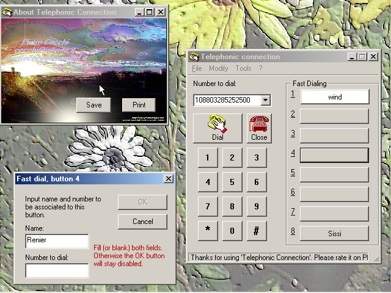



## Telephonic Connection

### Description

Hi,

I copied the look of the Windows Dialer.exe and

made it working the same (or even better).

Is this interesting?

...I mean, to have some code (not the original) for

those functionalities?

The response is up to you: if the audition will be high

then the effort will be crowned by success, otherwise

it will result... in a little flop!

The main advantage of having the source code, for a

programmer, is that you can modify any functionality

at your pleasure. Moreover, sometimes, there is the

advantage that the code can be studied, to learn

something more of VB world.

Let's resume how the Windows Dialer.exe works, and

point out some little differences of this code:

- [same]you can enter the telephonic number in 3 ways:

1) directly 2) using the telephonic keyboard

3) using the fast dialing buttons (where you can

store up to 8 names with their telephonic numbers).

- [difference]a help line at the bottom will assist you

in the use of all controls.

- [difference]an about form will teach you how to save,

print and even zoom an image (a surreal sunset).

The program can be used in your desktop, as is.

You will find dialing much more confortable and fast

than the original Windows Dialer.exe.

An additional usefull feature has been added to the

'Fast Dialing' buttons: they can be 'reordered' just

dragging the surrounding label and dropping in a new

place. Also here, not only the feature itself may be

found nice, but more the associated code could move

your curiosity.

That's it.

I bet this program will encounter your favour: so I

suggest you download the program, and hold it in your

desktop.

Go ahead, with computer dialing, and have fun!

Author: Pietro Cecchi

Program Name: Telephonic Connection Tone Dialer

Uploaded on Planet

(www.planet-source-code.com/vb): 21 november 2000

This program has been written in VB6.
 
### More Info
 
N.A.

easy

             |
---                |---
**Submitted On**   |2000-11-21 09:18:30
**By**             |[pietro ing\. cecchi](https://github.com/Planet-Source-Code/PSCIndex/blob/master/ByAuthor/pietro-ing-cecchi.md)
**Level**          |Intermediate
**User Rating**    |4.6 (23 globes from 5 users)
**Compatibility**  |VB 6\.0
**Category**       |[Complete Applications](https://github.com/Planet-Source-Code/PSCIndex/blob/master/ByCategory/complete-applications__1-27.md)
**World**          |[Visual Basic](https://github.com/Planet-Source-Code/PSCIndex/blob/master/ByWorld/visual-basic.md)
**Archive File**   |[CODE\_UPLOAD1188811212000\.zip](https://github.com/Planet-Source-Code/pietro-ing-cecchi-telephonic-connection__1-12982/archive/master.zip)

### API Declarations

see zip code

